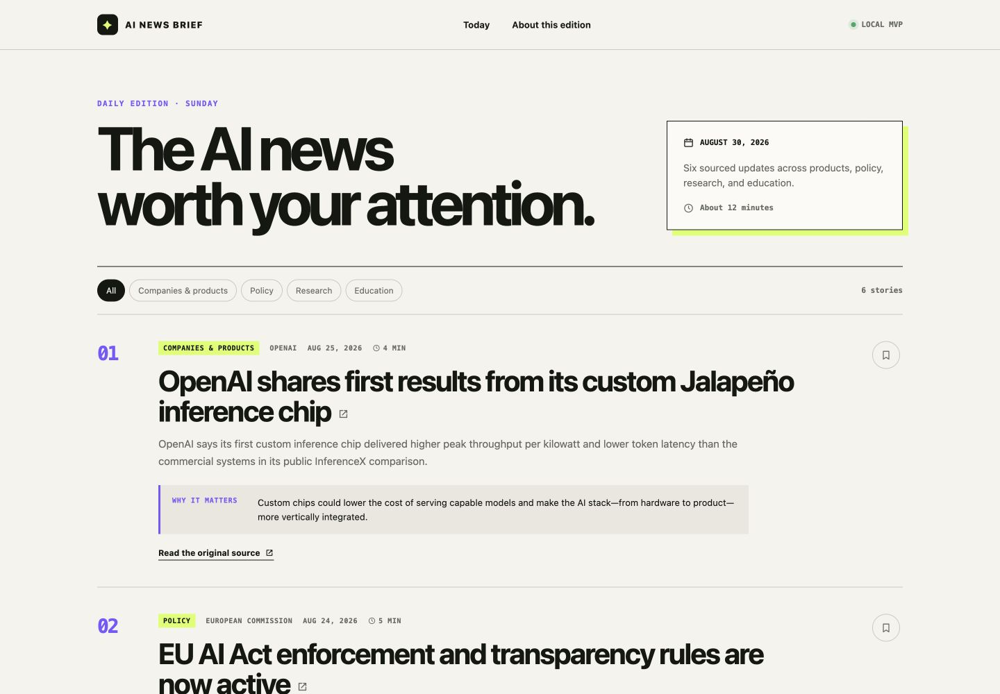
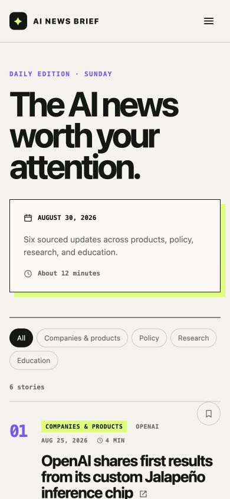

# AI News Brief — Astro Redesign

This repository contains the Week 2 Astro redesign of my original AI News Brief. The original Next.js checkpoint is preserved in Git history at commit `e58f695`, and the redesign is developed on the `astro-redesign` branch.

## Short specification

**Intended reader:** A busy student, educator, or general reader who wants a concise overview of important artificial-intelligence developments without scrolling through an infinite news feed.

**Purpose:** Present a small, manually curated edition that separates factual summaries from short explanations of why each development matters and links readers to every original source.

**Included:** A dated archive of fourteen editions from August 30 through September 13, 2026; selected stories covering products, policy, research, education, healthcare, and safety; dates, sources, reading times, summaries, significance explanations, original-source links, a responsive layout, per-edition category filters, and bookmarks saved in the current browser.

**Excluded:** User accounts, a database, automatic news collection, automatic publication, email subscriptions, and synchronization between browsers or devices.

### Observable success criteria

1. All fourteen editions have stable routes, retain their selected source information, summaries, and significance explanations, and are reachable from the archive selector.
2. The page remains readable and usable at a 1440-pixel desktop width and a 390-pixel narrow-screen width.
3. `npm run build` succeeds, creates `dist/index.html`, and that generated file contains the four current-edition story titles.

## Run the project locally

### Requirements

- Node.js 22.12 or newer
- npm

Install dependencies after cloning:

```bash
npm install
```

Start the development server:

```bash
npm run dev
```

Open the local address Astro prints, normally `http://localhost:4321`. Press `Control+C` in the terminal to stop the server. Run `npm run dev` again to restart it.

Create and preview the production output:

```bash
npm run build
npm run preview
```

`npm run dev` starts Astro's development server with live updates. `npm run build` generates static production files in `dist/`. `npm run preview` serves those generated files locally so the production result can be inspected. A local preview is not a public deployment.

### CLI evidence

The project was started from `/Users/kadenceberry/Desktop/CAH38601` with:

```bash
npm create astro@latest -- ai-news-brief-astro --template minimal --install --no-git --yes
```

- `npm` is the Node package manager program.
- `create astro@latest` asks npm to run Astro's current project-creation tool.
- `ai-news-brief-astro` names the new working folder.
- `--template minimal` selects the small starter.
- `--install` installs dependencies.
- `--no-git` initially avoided creating unrelated history; the original checkpoint history was copied in afterward.
- `--yes` accepts the stated defaults non-interactively.

The development command connects to this script in `package.json`:

```json
"dev": "astro dev"
```

Typing `npm run dev` therefore asks npm to execute `astro dev` from this project's installed dependencies.

## File map

| Path | Purpose | Edited or generated? |
| --- | --- | --- |
| `src/pages/index.astro` | Home-page route for the newest edition | Edited |
| `src/pages/editions/[slug].astro` | Generates one dated route for every archived edition | Edited |
| `src/components/EditionView.astro` | Shared edition page, archive selector, filters, bookmarks, and mobile-menu script | Edited |
| `src/components/StoryCard.astro` | Reusable markup for one story | Edited |
| `src/layouts/BaseLayout.astro` | Shared HTML document, metadata, global stylesheet, and slot | Edited |
| `src/data/editions.ts` | Typed records for all fourteen editions and their selected stories | Edited |
| `src/styles/global.css` | Responsive visual design | Edited |
| `package.json` | Maps npm commands to Astro commands and lists Astro as a dependency | Edited by setup |
| `package-lock.json` | Locks the exact installed dependency versions | Generated by npm and committed |
| `public/` | Favicon and social-preview image served unchanged | Edited/copied |
| `dist/` | Static production output created by `npm run build` | Generated; not edited or committed |

## How the Astro parts work

These shortened excerpts show the boundary between build-time work and template output:

```astro
---
// src/pages/index.astro frontmatter: evaluated while Astro generates the page.
import EditionView from '../components/EditionView.astro'; // Import
import { editions, latestEdition } from '../data/editions'; // Import/declaration
---

<!-- Template markup with prop expressions -->
<EditionView edition={latestEdition} editions={editions} />

<!-- Inside EditionView.astro, an expression repeats the story component. -->
<div class="story-list">
  {edition.stories.map((story, index) => (
    <StoryCard story={story} index={index} />
  ))}
</div>
```

`BaseLayout.astro` supplies the one complete HTML document. The page is nested inside `<BaseLayout>...</BaseLayout>`, and the layout's `<slot />` marks where that page content appears.

### Trace one actual story

1. `src/data/editions.ts` stores the August 30 title `OpenAI shares first results from its custom Jalapeño inference chip` in a story record inside an edition.
2. `EditionView.astro` receives the selected edition.
3. `edition.stories.map(...)` visits that record and passes the complete `story` object into `StoryCard` as a prop.
4. `StoryCard.astro` receives it through `const { story, index } = Astro.props`.
5. The component expression `{story.title}` inserts the title into its `<h2>` link.
6. `BaseLayout.astro` places the page and cards at its `<slot />`.
7. The production build contains the resulting title text in `dist/index.html`.

Frontmatter cannot respond to a reader's click because it runs before the static page reaches the browser. The normal `<script>` in `EditionView.astro` runs in the browser, where `document`, click events, and `localStorage` exist. That script handles edition navigation, filtering, bookmarks, and mobile navigation.

## Two small experiments

### Experiment 1 — content/prop change

**Prediction:** Changing one title value passed to a `StoryCard` will change only that card's heading.

**Edit:** I changed the title of one card while leaving the second card's prop unchanged.

**Observation:** Only the edited card's `<h2>` changed. The reusable component uses the prop value belonging to each individual instance.

### Experiment 2 — shared layout change

**Prediction:** Changing the footer inside a shared layout will update every page that uses that layout.

**Edit:** I changed the practice layout footer from `AI News Brief practice project` to `Created for CAH38601`.

**Observation:** Both the home and about routes displayed the new footer after rebuilding. The pages were not directly connected to each other; both depended on the same layout. This corrected my first prediction that only the home page would change.

## Personally chosen revision

I retained category filters and browser-saved bookmarks through recommendation of ChatGPT even though the assignment permits deferring them until Week 3. The filters help a reader narrow a six-story edition by topic, and the bookmarks let a reader mark stories to revisit. I kept this interactivity in a small plain browser script rather than adding React to the Astro project. I verified that the Policy filter displays one story and that selecting a bookmark changes its pressed state and saves its ID in `localStorage`.

## Verification evidence

### Production build

The following command completed successfully on September 13, 2026:

```bash
npm run build
```

After the archive expansion, Astro reported fifteen generated pages: the newest-edition homepage plus fourteen dated routes under `dist/editions/`. The generated homepage contains all four September 13 story titles, and the dynamic archive includes routes for every edition through `dist/editions/2026-09-13/index.html`.

### Responsive screenshots

Desktop verification at 1440 × 1000:



Narrow-screen verification at 390 × 844:



At the narrow width, the two-column introduction becomes one column, the navigation collapses to a menu button, filter controls wrap, and each story becomes a compact two-column layout without horizontal overflow.

### Source-link check

All six source URLs were checked on September 6, 2026. The European Commission and Anthropic pages returned HTTP `200`. The four OpenAI pages rejected the command-line client with HTTP `403` but opened successfully in a normal browser with the expected final URLs and page titles. This indicates bot protection rather than broken links.

## Reflection

Astro evaluates the frontmatter imports, the `stories.map(...)` expression, and the component templates during the production build. It turns the six data records into static HTML, so readers can see the content without waiting for a client-side application to render it. In contrast, the filter, bookmark, and menu event listeners run in the reader's browser because they respond to clicks and use browser APIs such as `document` and `localStorage`.

AI helped scaffold the project, translate the original React structure into Astro components, and identify build and browser checks. I did not treat generated code as automatically correct. I predicted and observed how frontmatter values, individual props, and shared layout changes behave; checked the generated HTML; compared desktop and narrow layouts; tested a filter and bookmark; and verified each source URL.

My personally chosen revision was retaining filters and bookmarks with plain browser JavaScript. This keeps the reading experience from the original design while still following Astro's preference for minimal client-side JavaScript.

## Hosting decision and limitations

The graded artifact is verified through a local production build and preview. It is not presented as a public deployment. The GitHub repository is private, so the instructor must be granted repository access before submission. Bookmarks remain only in the current browser profile, and content updates are manual because accounts, databases, and automatic news collection are outside this assignment's scope.

## Conference notes

- **Design decision:** Retain the original editorial dashboard character—warm paper background, black typography, purple signals, and acid-green highlights—while replacing the React application shell with static Astro components.
- **Unresolved question:** At what level of future interaction would a framework island become clearer than continuing to use a plain browser script?
